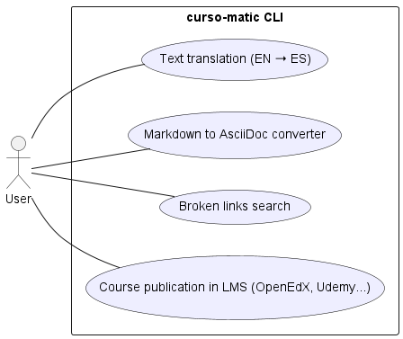

# curso-matic

**curso-matic** is a command-line interface (CLI) tool designed to help you efficiently manage online courses. It aims to simplify content translation, format conversion, link validation, and publishing on multiple e-learning platforms such as OpenEdX and Udemy.

## Key Features

* **Translate content** from English to Spanish using the ChatGPT API, with support for excluding specific sections like code blocks or keyword lists.
* **Convert Markdown to AsciiDoc** to prepare course content for various publishing platforms.
* **Check for broken links** in Markdown or AsciiDoc documents.
* **Publish courses** to e-learning platforms such as OpenEdX or Udemy (with proper credentials).

## Use Case Diagram

The following diagram summarizes the main features of `curso-matic` from the user's perspective:

